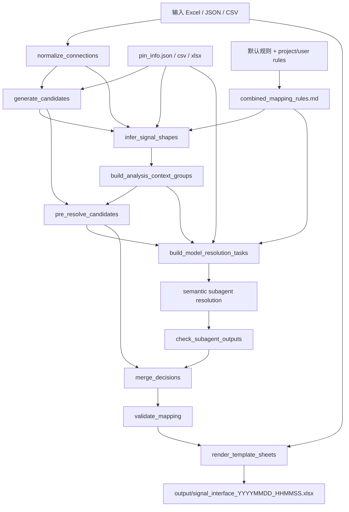

# OpenClaw Signal Mapping Layered Skill

## 最重要的执行契约

当用户要求"基于框图逻辑链接分析原理图的映射关系"/“根据框图和 pin_info 推出映射”，调用本 skill 输出结果时，默认目标是生成经过语义分析的正式 Excel，而不是只生成脚本兜底表。

必须遵守：

```text
1. stage=all 只执行脚本路径，不会自动调用语义 subagent。
2. 如果 stage=all 后大部分 decision 是 unresolved，不能宣称最终结果已完成。
3. 完整语义输出必须执行：
   prepare/model_tasks
     -> 阅读 global_link_plan.md/json、subagent_session_plan.md/json、subagent_task_plan.md/json
     -> 按 source_device session 启动或等价执行隔离语义分析
     -> 同一个 session 内顺序处理多个小 TASK，并更新 pin_allocation_state_file
     -> 每个 TASK 写入 output_contract.output_file
     -> stage=finish
     -> 主控检查 subagent output_file 并合并 intermediate/model_resolved_decisions.jsonl
     -> 检查 validation_report.json。
4. 必须按 subagent_session_plan 启动隔离 subagent；一个 session/context_group 代表一个源端器件 pin 体系。小 TASK 只是降低单次推理负担，不代表要为同一源端器件启动多个互不共享状态的 subagent。一批最多并行拉起2个subagent任务，等一批任务完成再拉起下一批。

```

完整步骤见：

```text
RUNBOOK.md
```

## 核心目标

根据输入框图连接事实、源端器件 pin 列表、自然语言硬件规则，生成：

```text
output/signal_interface_YYYYMMDD_HHMMSS.xlsx
```

输出必须严格沿用输入 Excel 的 sheet 结构：

```text
block_info 原样保留
其他连接 sheet 重建为标准 13 列
```

## 主逻辑

```text
normalize_connections
  ↓
generate_candidates
  ↓
infer_signal_shapes
  ↓
build_analysis_context_groups
  ↓
pre_resolve_candidates
  ↓
build_model_resolution_tasks
  ↓
semantic subagent resolution
  ↓
merge_decisions
  ↓
validate_mapping
  ↓
render_template_sheets
```

运行阶段框图：



脚本负责事实整理、候选生成、信号形态前置判断、任务隔离、校验和渲染。

### 源端 pin_info 硬门禁

`pin_info.json` 是唯一可信的原理图 pin 来源。框图中的 `源Port`、`目的Port`、`连线名称`、block 名称、link_info、自然语言规则都只是语义线索，不能替代 `pin_info.json` 生成 `原理图Pin脚`。

如果当前 normalized connection 的 `source_part_id` 在 `pin_info.json` 中找不到对应 pin 列表，或找到的是空列表，则该源端器件不具备 pin 选择前提：

1. `generate_candidates` 输出 `available_pins=[]`。
2. `pre_resolve_candidates` 直接写 `unresolved / Low / needs_human_review=true`，`selected_pin=""`，`net_name=""`。
3. 该行不得写入 `needs_model_resolution.jsonl`，不得为该源端器件创建 semantic subagent/TASK；不能用框图 port 名、规则或器件常识让模型猜 pin。
4. 最终 Excel 保留原连接行，`原理图Pin脚` 和 `网络命名` 为空，等待用户补充该源端器件的 pin 信息。

模型负责根据框图表链路上下文、自然语言规则和 pin 列表做语义判断。context_group 按源端器件 pin 体系分组；链路族、信号族、目标上下文作为组内分析上下文传给 subagent，并显式写入任务包的 `diagram_link_context`。重复主链路采用 link-family-first：先理解链路族全局语义，再在链路约束下复用器件类型局部 pin 规则。脚本还会生成 `link_family_profiles`，把同一 link_family 跨 source_device subagent 的链路拓扑、实例、用户说明和角色信息共享给相关 TASK；它只用于借鉴链路语义，不做 pin 裁决。`infer_signal_shapes` 会在语义映射前根据总线写法、pin 列表 P/N 对和自然语言规则提示生成 `signal_shape_info`；如果一条原始连接对应多个物理 pin，会先展开为 `原line_id#数字`，再进入候选生成和 subagent 分析。`sheet_device_context` 表达同一 sheet 是一个物理器件实例，sheet 内不同 block 是该器件的逻辑块/端口视图；`pin_allocation_context` 表达同一物理器件实例内 pin 默认不可被不同语义连接重复使用。没有 `link_info` / `链路信息` 或没有显式 `link_family` 时，仍按 block_info 器件信息、源/目的 Block、端口名和 mapping_family 在同一个源端器件组内分析。

## 必须遵守

1. 不得根据模型、group、context_group 新建输出 sheet。
2. 最终输出 sheet 只能来自输入 Excel。
3. `block_info`、`link_info` / `链路信息` 原样保留。
4. 连接 sheet 输出标准 13 列。
5. 前 9 列是原始连接事实，模型不得修改。
6. 信息不足时输出 `unresolved`，不得硬猜。
7. 一条逻辑连接对应多个物理 pin 时，优先在映射前或 subagent 输出阶段展开为 `主line_id#数字` 多行；兼容旧任务时才使用 `selected_pins` 数组。
8. `原理图Pin脚` / `selected_pin` / `selected_pins` 必须逐字来自入参 `pin_info.json` 中该源端器件编码对应的 pin 列表；不得翻译、补全、改写、大小写规范化或输出其他器件的 pin。
9. 如果入参 `pin_info.json` 中没有当前源端器件编码对应的 pin 列表或列表为空，则该源端器件不能进入语义模型分析；相关连接保持 `unresolved`，等待用户补充 pin 信息。
9a. 严禁用框图 `源Port` / `目的Port` / 连线名 / 规则文本 / 器件常识伪造 pin，也严禁为了这类缺 pin 对象额外生成 subagent 任务。
10. 输入框图中的有效连线名称（非空且不包含 `line`，不区分大小写）是最终 `网络命名` 最高优先级；没有有效连线名称且没有 `selected_pin` / `selected_pins` 时，最终 `网络命名` 必须为空。
11. `LINE_xxx`、`line`、包含 `line` 的连线名称是画图工具默认名，不是有效网络名，不能直接复制到 `net_name` / `net_names`。
12. 如果 subagent 结合上下文判断某条未展开 line 是差分/总线，应输出多行 decision：`line_id=原line_id#数字`、`parent_line_id=原line_id`、每行一个 `selected_pin`；merge/validate/render 会按 parent 复制原连接事实。

## 关键文件

完整语义生成 runbook：

```text
RUNBOOK.md
```

结构说明：

```text
STRUCTURE.md
```

主流程：

```text
workflows/main_pipeline.md
```

自然语言规则入口：

```text
rules/natural_language_mapping_rules_template.md
```

上游编排如果通过接口获取器件规则，应先把接口结果写成 RULE markdown 文件：

```text
external_device_rules.md
```

推荐放置位置：

```text
<task_root>/design/external_device_rules.md
```

也支持自动发现：

```text
<task_root>/design/external_device_rules.md
<task_root>/input/external_device_rules.md
<task_root>/rules/external_device_rules.md
<connections 所在目录>/external_device_rules.md
```

运行命令仍可通过 `--project-rules` / `--user-rules` 追加其他外部自然语言规则。自动发现的 `external_device_rules.md` 会作为 project rules 追加；默认规则、外部器件规则和显式外部规则会合并为：

```text
<task_root>/signal_interface/intermediate/combined_mapping_rules.md
```

前置 `infer_signal_shapes` 和后续 `build_model_resolution_tasks` 必须读取同一份 combined rules。

可选链路信息入口：

```text
输入 Excel 中的 link_info / 链路信息 sheet
推荐列：链路类型 / 链路编号 / 器件Sheet / 用户标识的链路信息 / 器件角色说明 / 相关连线ID
```

该 sheet 是可选增强信息，不是必填输入。它只作为对应源端器件 subagent 的上下文，不会单独触发新的 context_group。没有链路级数据时，context_group 会使用 `link_family_source=fallback_device_context` 或 `fallback_mapping_family` 作为组内上下文，subagent 按器件类型和映射族继续分析。

导出的每个 `TASK_xxx.json` 必须包含：

```text
diagram_link_context
sheet_device_context
pin_allocation_context
link_family_profiles
matched_rule_sections
```

`diagram_link_context` 把框图信息表中的链路信息整理为当前 context_group 的模型上下文，包括链路族、链路编号、用户链路说明、器件角色说明、相关 sheet 和逐行 line_id 的链路上下文。`sheet_device_context` 把输入 sheet 解释为物理器件实例，并列出 sheet 内逻辑 block/port。`pin_allocation_context` 列出同一物理器件实例内的 line_id、scalar/bus/differential 判断、候选 pin 空间和可能允许共享 pin 的同源端口扇出/同网/同 base_connection 分组。`link_family_profiles` 是同一 link_family 跨多个 source_device subagent 共享的链路级上下文，用于借鉴拓扑、方向、实例索引、差分/总线展开规律和用户说明；不得直接复制其他 line_id 或其他源端器件的 selected_pin。`matched_rule_sections` 是脚本召回的候选自然语言规则块，每块包含 `layer`、`source_file`、`match_type` 和 `score`。subagent 必须先阅读它们，并按 `custom/user > link > device > signal > global > 名称相似度` 使用，不能按数组位置或 score 直接裁决 pin。

自然语言规则分为：

```text
链路族规则：重复主链路的整体功能、方向、器件角色、索引和 P/N 传播
链路级规则：跨器件业务链路拓扑、方向、索引关系
器件级规则：单个器件 code/料号下的 pin 功能
通用信号规则：SPI、差分、电源、总线等通用语义
```

规则模板可以用简单自然语言 RULE 块做召回索引：

```text
### RULE: <规则ID> <简短名称>
适用条件：
源端器件：...
链路类型：...
典型端口：...
规则摘要：
...
```

脚本按目录识别 RULE 层级，并优先按 source_part_id、link_family、mapping_family、signal_shape 和适用条件做确定性召回；`GLOBAL_MAPPING` 与 `SIGNAL_SPECIAL` 作为通用约束常驻。剩余未结构化规则才使用关键词补充召回。召回结果写入 `matched_rule_sections`，不做 pin 裁决；最终仍由 subagent 结合框图链路上下文和 pin 列表逐条判断。

语义模型 prompt：

```text
prompts/semantic_mapping_resolver.md
```

启动 subagent 前的全局规划输出：

```text
intermediate/model_resolution_tasks/subagent_task_plan.md
intermediate/model_resolution_tasks/subagent_task_plan.json
```

模型任务计划会持久化到本地，展示每个任务的可读文件名、器件类型、源端器件编码、context_group、link family、line 数量和任务目标。任务 JSON/prompt 位于 `intermediate/model_resolution_tasks/tasks/`，文件名格式为 `TASK_序号_器件类型_器件编码_链路范围_hash`，便于用户检查。

每个 TASK 都包含 `output_contract`，其中 `output_file` 指向：

```text
intermediate/subagent_outputs/TASK_xxx.jsonl
```

subagent 必须把 mapping_decision 写成 JSONL 到该文件。只在聊天中输出 JSON 或分析说明、不写入该文件，视为失败。`stage=finish` 会先运行主控检查：文件不存在、JSONL 非法、line_id 缺失/重复/额外都会生成 `intermediate/failed_subagent_rerun_plan.md` 并中止，必须重新启动失败 subagent 后再 finish。

规则层级：

```text
rules/rule_layers.md
```

核心脚本：

```text
script/run_pipeline.py
script/normalize_connections.py
script/generate_candidates.py
script/build_analysis_context_groups.py
script/pre_resolve_candidates.py
script/build_model_resolution_tasks.py
script/check_subagent_outputs.py
script/merge_decisions.py
script/validate_mapping.py
script/render_template_sheets.py
script/generate_net_name.py   ← 华为规范网络命名生成（独立模块）
```

## 阶段命令

注意：下面的 `all` 只适合冒烟验证，不适合作为正式语义输出。正式输出请按 `RUNBOOK.md` 执行 `model_tasks -> 语义分析 -> finish`。

准备中间数据：

```bash
python script/run_pipeline.py \
  --task-dir data/{uuid} \
  --connections input_block_diagram.xlsx \
  --pins pin_info.json \
  --stage prepare
```

导出模型任务包：

```bash
python script/run_pipeline.py \
  --task-dir data/{uuid} \
  --connections input_block_diagram.xlsx \
  --pins pin_info.json \
  --stage model_tasks
```

模型分析后，将结果写入：

```text
data/{uuid}/signal_interface/intermediate/subagent_outputs/TASK_xxx.jsonl
```

`stage=finish` 会检查所有 subagent output_file，全部通过后自动合并为：

```text
data/{uuid}/signal_interface/intermediate/model_resolved_decisions.jsonl
```

合并、校验并渲染：

```bash
python script/run_pipeline.py \
  --task-dir data/{uuid} \
  --connections input_block_diagram.xlsx \
  --template-excel input_block_diagram.xlsx \
  --pins pin_info.json \
  --output-mode template_sheets \
  --stage finish
```

一键脚本流程：

```bash
python script/run_pipeline.py \
  --task-dir data/{uuid} \
  --connections input_block_diagram.xlsx \
  --template-excel input_block_diagram.xlsx \
  --pins pin_info.json \
  --output-mode template_sheets \
  --stage all
```

注意：`all` 不会自动调用真实 subagent；它会把未解决项保留为 `unresolved`。需要模型语义分析时使用 `model_tasks` 阶段导出任务包。

## 网络命名规范（华为原理图标准）

网络命名在 `script/generate_net_name.py` 中实现，渲染阶段由 `render_template_sheets.py` 统一调用。

### 字符集约束（强制）

| 约束 | 说明 |
|------|------|
| SCREAMING_SNAKE_CASE | 全部大写，字符之间用下划线 `_` 分割 |
| 以字母开头 | 数字开头会自动加前缀 `N` |
| 长度 ≤ 31 字符 | 超出自动截断 |
| 中划线 `-` | 自动替换为下划线 `_` |

### 命名优先级

**规则 1（最高优先级）：连线名称优先**

`connection_name` 非空且不包含 `line`（不区分大小写）时，直接使用连线名称（清洗后），不再按规范生成。

有效 `connection_name` 是最高优先级，即使模型输出了其他 `net_name`，渲染阶段也必须优先使用输入框图中的有效连线名称；如果 `connection_name` 包含 `line`，视为默认连线名，必须按信号语义生成或由模型输出有效网络名。没有有效连线名称且没有选中原理图 pin 时，渲染阶段输出空网络名。

```text
示例：
  connection_name = "SW0007_SROC0_SP9T_FBV0_1M_LC18" → 网络名 = SW0007_SROC0_SP9T_FBV0_1M_LC18
  connection_name = "HBF_PS0_CTRL_120V_BIT0_0001"     → 网络名 = HBF_PS0_CTRL_120V_BIT0_0001
  connection_name = "VDD_5V0_PMU_PA0007_2431_VA_2A2"  → 网络名 = VDD_5V0_PMU_PA0007_2431_VA_2A2
```

**规则 2：按信号类型规范生成**

`connection_name` 为空或包含 `line` 时，按信号类型执行对应格式：

#### 射频信号（RF_CHAIN，6 部分）

格式：`类型_源端_目的端_通道_频率_极性`

```text
TX_CH0_1M     → TX_SROC_TXVGA_CH0_1M
RX_CH1_1M_P  → RX_SROC_PAM_CH1_1M_P
FB_CH2_1M_N  → FB_HBF_FILTER_CH2_1M_N
CAL_CH0      → CAL_SROC_TXCAL_CH0
```

#### 电源信号（POWER_ENABLE，6 部分）

格式：`PWR_电压值_通道_负载_管脚`

```text
PWR_5V0_CH0_PA0_VDD_5V0    → 比邻星供电，电压5V0，通道0，负载PA0
PWR_0V65_CH7_SIRIUS_HBF   → 天狼星0供电，电压0V65，通道7，负载HBF
PWR_1V8_PULSAR_TX_AFE0    → 比邻星供电，电压1V8，负载TXA FE
```

#### 数字控制信号（SPI/I2C/GPIO，9 部分）

格式：`总线_编号_发送端_接收端_信号_频率_电平_后缀`

```text
SPI0_SROC_AMC_ESPI0_SROC_  → SPI0总线，发送端SROC，接收端AMC
I2C1_CPU_EEPROM_SCL_100K  → I2C1总线，发送端CPU，接收端EEPROM
GPIO0_SROC_FPGA_PORT_      → GPIO控制
```

#### DAC / ADC

```text
DAC00_SROC_TXVGA_AFE_1M6    → DAC00，SROC→TXVGA，AFE链路
ADC00_PAM_FB_SROC_1M6       → ADC00，PAM反馈→SROC
```

#### Block 简称规范

| 原名称 | 简称 | 说明 |
|--------|------|------|
| SROC / SROC城堡板 | SROC | 核心控制芯片 |
| TX VGA00_00-01 | TXVGA | TX VGA 器件 |
| PA0 / PA1 / PA3 | PA0 / PA1 / PA3 | 功放 |
| AMC7964_00-03 | AMC | ADC/DAC 多路复用 |
| RF Filter0~7 | FILTER | 射频滤波器 |
| 功放模组00_02-05 | PAM | 功放模组 |
| HBF0811/1619/2427 | HBF | 混合滤波器 |
| 比邻星0~7 | PULSAR | 电源管理IC |
| 天狼星0 | SIRIUS | 电源管理IC |
| 集成驱动0/1 | DRV0 / DRV1 | 集成驱动 |
| 反馈九选一开关 | FB | 反馈开关 |
| 633_9036_TXCAL_1 | TXCAL | TX 校准 |
| 633_9029_RXCAL_1 | RXCAL | RX 校准 |

### 模块接口

```python
from generate_net_name import generate_net_name, abbreviate_block

# 生成单条网络名
net_name = generate_net_name(normalized_connection_dict, selected_pin="")

# 单独获取 block 简称
abbr = abbreviate_block("SROC城堡板")  # → "SROC"

# CLI 测试
python script/generate_net_name.py intermediate/normalized_connections.jsonl
```
