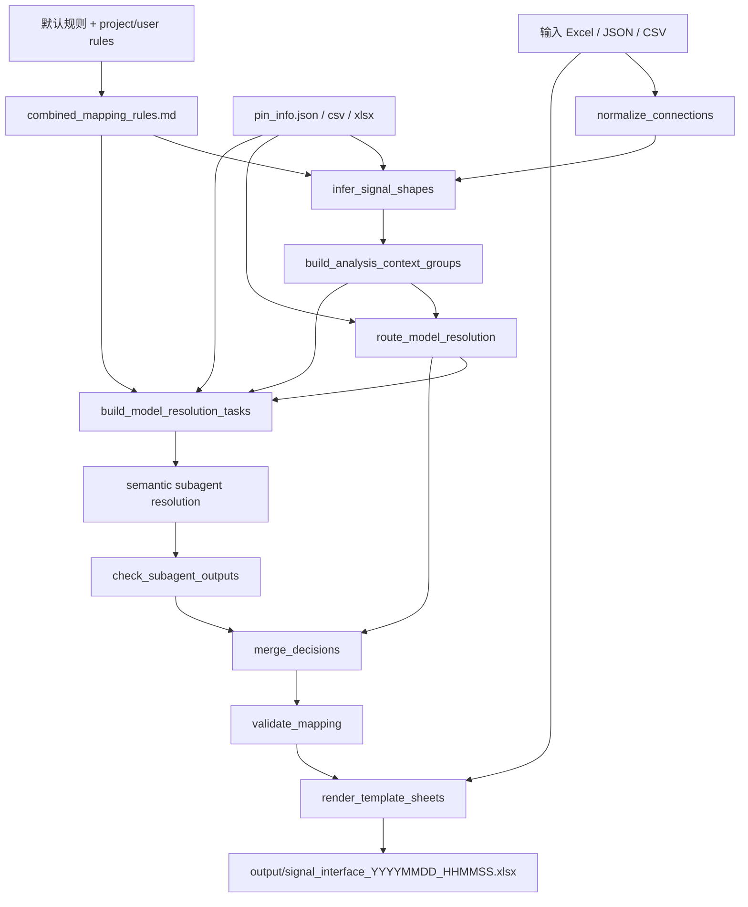

# openclaw Signal Mapping Skill 结构说明

本文档说明 `D:\github\signal\signal_connections_mapping` 这个 skill 的目录结构、主流程、关键数据契约和 subagent 分组逻辑。

## 1. 总体目标

该 skill 用于把输入框图 Excel 和 `pin_info.json` 转换成标准 13 列信号接口列表。

核心约束：

```text
1. 输出 workbook 沿用输入 workbook 的 sheet 顺序和分页结构。
2. block_info 原样保留。
3. link_info / 链路信息 如果存在，也原样保留。
4. 其他连接 sheet 重建为标准 13 列。
5. 前 9 列连接事实来自输入框图，除多物理 pin 展开时连线ID追加 #数字外，不得被模型或脚本改写。
6. 后 4 列由脚本预裁决、模型语义分析、人工覆盖结果合并得到。
7. `原理图Pin脚` 必须逐字来自入参 `pin_info.json` 中当前源端器件编码对应的 pin 列表；不得改写 pin 字符串。入参没有该器件编码时，跳过该器件语义分析并保持 unresolved。
```

标准 13 列：

```text
源Block标识
源Block名称
源Port
目的Block标识
目的Block名称
目的Port
连线ID
连线名称
连线方向
原理图Pin脚
分析说明
映射置信度
网络命名
```

## 2. 顶层目录

```text
signal_connections_mapping/
├── SKILL.md
├── README.md
├── RUNBOOK.md
├── STRUCTURE.md
├── .gitignore
├── script/
├── prompts/
├── rules/
├── schemas/
└── workflows/
```

### SKILL.md

Codex 调用该 skill 时最先读取的入口说明。它描述：

```text
1. skill 的核心目标。
2. 主流程顺序。
3. 必须遵守的输出约束。
4. 关键脚本、prompt、规则文件。
5. 常用阶段命令。
```

### README.md

面向使用者的快速说明。它描述如何准备输入、如何运行 prepare/model_tasks/finish/all，以及最终输出约束。

### RUNBOOK.md

面向执行模型的完整语义生成步骤。它明确说明：

```text
1. stage=all 不是完整语义流程。
2. 正式输出必须经过 model_tasks、subagent 写入 output_contract.output_file、主控检查、model_resolved_decisions.jsonl、finish。
3. subagent 批次如何规划、如何约束输出、失败如何重启、如何合并和校验。
```

### STRUCTURE.md

当前文件。面向维护者，用于解释目录职责、数据流、schema、subagent 分组和扩展点。

### .gitignore

忽略 Python 缓存、调试输出、任务中间目录，避免 `__pycache__` 和本地验证产物进入 skill。

## 3. 主流程

主入口脚本：

```text
script/run_pipeline.py
```

流程：

```text
init_task
  ↓
normalize_connections
  ↓
infer_signal_shapes
  ↓
route_model_resolution
  ↓
build_analysis_context_groups
  ↓
build_model_resolution_tasks
  ↓
semantic subagent resolution
  ↓
check_subagent_outputs
  ↓
merge_decisions
  ↓
validate_mapping
  ↓
render_template_sheets
```

阶段命令：

```text
prepare:     生成 normalized_connections、signal_shape_inference、analysis_context_groups
apply:       生成 pre_resolved_decisions 和 needs_model_resolution
model_tasks: 生成按源端器件 pin 体系隔离的 subagent 任务包和 subagent_task_plan
finish:      合并模型/人工结果，校验并渲染 Excel
all:         只走脚本路径，不会自动调用真实 subagent；只适合冒烟验证，未解决项保持 unresolved
```

正式语义输出必须按 `RUNBOOK.md` 执行，不得停在 `stage=all`。

## 4. script 目录

### script/common.py

公共工具：

```text
1. JSON/JSONL/CSV/XLSX 读写。
2. 文本标准化、方向标准化、简单名称相似度。
3. pin_info.json 加载。
4. 前导零料号兼容匹配。
5. 标准 13 列表头常量。
```

`pin_info.json` 原生格式：

```json
{
  "47151290": ["PIN_A", "PIN_B"],
  "0302078562": ["PIN_C", "PIN_D"]
}
```

脚本直接使用 `{器件料号: [pin名...]}`，不转换为 `{device_part_id, pin}` 对象列表。

### script/init_task.py

创建任务目录：

```text
task_root/
└── signal_interface/
    └── intermediate/
```

`output/` 只在 `finish` / render 阶段真正写出 Excel 时按需创建；所有本 skill 产物都收拢在 `signal_interface/` 下，不再初始化空的 `logs/`、`rules/` 等目录。

### script/normalize_connections.py

把输入框图表标准化为 `intermediate/normalized_connections.jsonl`。

职责：

```text
1. 读取 Excel 的所有连接 sheet。
2. 跳过 block_info、link_info / 链路信息、说明、目录等非连接 sheet。
3. 读取 block_info 中的 框图标识 -> 器件信息。
4. 建立 block_id/block_name/sheet_name 到器件信息的别名。
5. 读取可选 link_info / 链路信息 sheet。
6. 保留输入前 9 列连接事实。
7. 只展开显式总线格式，例如 XXX[7:0] 或 XXX*4。
8. 生成 source_part_id、target_part_id、link_contexts 等模型上下文字段。
```

可选链路信息 sheet 推荐列：

```text
链路类型 | 链路编号 | 器件Sheet | 用户标识的链路信息 | 器件角色说明 | 相关连线ID
```

说明：

```text
1. 链路类型相同表示一个 link_family。
2. 链路编号表示具体链路实例。
3. 器件Sheet 表示这条链路涉及哪些 sheet。
4. 相关连线ID 可空；为空时表示 sheet 参与该链路，但具体连接归属交给 subagent 判断。
5. 同一个 sheet 可以出现在多条链路中，例如 HBF 同时属于 TX/RX 链路。
```

### script/build_analysis_context_groups.py

生成 `intermediate/analysis_context_groups.json`。

硬分组维度：

```text
source_device_signature
isolation_level
```

也就是说，context_group 表示“同一个源端器件 pin 体系下的一组待分析连接”。如果 `source_part_id` 存在，同料号不同实例会合并分析；如果源端器件信息缺失，则按 sheet/block 上下文隔离未知源端。

组内上下文字段：

```text
link_family_ids
link_family_sources
target_device_signatures
mapping_families
link_contexts
link_instance_ids
user_link_infos
device_role_infos
```

`link_family_sources` 含义：

```text
explicit_link_info: 来自 link_info / 链路信息 sheet
inferred_from_connection: 从连接文本推断出链路族
fallback_mapping_family: 无显式链路族，按 RF/SPI/POWER/CLOCK 等映射族兜底
fallback_device_context: 无显式链路族和明确映射族，按器件上下文兜底
```

链路级数据、信号族和目标上下文不再用于重新起 subagent；它们只帮助同一个源端器件 subagent 判断每条连接的作用。

### script/route_model_resolution.py

按 `source_part_id` 读取 `pin_info.json`，只执行模型路由门禁，不生成候选 pin，也不自动预裁决。

有非空源端 pin 列表的连接全部进入 `needs_model_resolution.jsonl`。缺 pin 的连接直接保持 unresolved，不生成语义 TASK。

### script/build_model_resolution_tasks.py

根据 `analysis_context_groups.json` 和 `needs_model_resolution.jsonl` 生成隔离 subagent 任务包：

```text
intermediate/model_resolution_tasks/
├── manifest.json
├── global_link_plan.md
├── global_link_plan.json
├── subagent_session_plan.md
├── subagent_session_plan.json
├── subagent_task_plan.md
├── subagent_task_plan.json
├── subagent_task_prompt.md
└── tasks/
    └── TASK_01_SROC_302078562_MULTI_LINK_61889c68782d_PART01.json
```

任务包包含：

```text
1. task_scope
2. context_group
3. source_device_pins
4. pin_catalog_context
5. diagram_link_context
6. connection_defaults
7. normalized_connections
8. matched_rule_refs
9. output_contract
10. schema_file
```

当源端器件 pin 数量超过 100 时，同一 session 额外生成一个 `*.pin_groups.json`。它只包含固定轻量分组、完整 `all_pins` 和必要元数据；分组无损、多标签且不排名。TASK 的 `source_device_pins` 只内嵌当前组，`pin_catalog_context` 指向其他组和完整列表。100 个及以下 pin 继续直接内嵌完整列表。

平衡模式下，`subagent_session_plan` 控制实际 subagent 启动粒度：一个 source_device session 对应一个源端器件 pin 体系；同一 session 下可以有多个小 TASK。小 TASK 的分片原则是源端物理器件实例优先、链路/信号语义其次、数量上限最后，默认每个 TASK 不超过 50 条 line。小 TASK 用于降低单次推理上下文，不表示要为同一源端器件启动多个互不共享状态的 subagent。

`task_scope` 包含：

```text
execution_mode
subagent_session_id
subtask_index_in_session
subtask_count_in_session
pin_allocation_state_file
session_context_file
physical_device_instance_ids
previous_task_outputs
```

subagent 必须按同一 session 顺序处理 TASK。session 开始时读取一次 `session_context_file`；每个 TASK 前读取最新 `pin_allocation_state_file`，不嵌入生成时即过期的 snapshot。处理后按 `physical_device_instance_id` 写回已用 pin、允许复用 pin、冲突和 completed_task_ids。

`diagram_link_context` 是从输入框图表/link_info/链路信息 sheet 和逐行连接事实整理出的链路上下文，包含：

```text
group_link_family_ids
group_link_instance_ids
group_user_link_infos
group_device_role_infos
group_link_contexts
```

它只保存组级语义。逐行 block、port、link 和 shape 事实只保存在 `normalized_connections`。

`session_context_file` 保存同一 session 共用的静态信息：

```text
sheet_device_context
pin_allocation_context
link_family_profiles
rule_library
```

同一个 `source_sheet_name` 表示一个物理器件实例；同 sheet 内不同 block 是逻辑块或端口视图。

`pin_allocation_context` 表达同一物理器件实例内的 pin 分配约束，包含：

```text
pin_reuse_policy
physical_device_pin_spaces
potential_shared_pin_groups
```

默认规则是：同一个 `physical_device_instance_id` 内，普通 scalar 连接的同一个物理 pin 只能分配给一个不同语义的 line_id。总线/差分需要先识别为 bus/differential，并优先输出 `parent_line_id=原line_id` 且 `line_id=原line_id#数字` 的多行 decision，每行一个 selected_pin。只有相同源端口扇出到多个目标端口、相同网络名、相同 base_connection_id、多端口别名，或用户/规则明确说明一个器件引脚给多个端口时，才允许多个 line_id 共用同一个 pin 和网络名。不同 sheet 表示不同物理器件实例，因此可以使用相同 pin 名。

`link_family_profiles` 是同一 link_family 跨 source_device subagent 共享的链路级上下文，包含：

```text
link_family_id
context_group_ids
source_device_signatures
target_device_signatures
mapping_families
link_instance_ids
member_sheets
user_link_infos
device_role_infos
line_examples
shared_semantic_hints
```

它解决“链路逻辑如何给其他链路/其他器件 subagent 借鉴”的问题：同一 link_family 下的 subagent 可以共享链路拓扑、方向、实例索引、差分/总线展开规律和用户说明。它不是规则裁决结果，不能直接复制其他 line_id 或其他源端器件的 selected_pin。

规则正文按 session 去重保存在 `rule_library`；TASK 的 `matched_rule_refs` 只保存 rule_key、match_type 和 matched_terms。脚本先做确定性召回，再用关键词补充；召回不做 pin 裁决，也不提供 pin 排名。

启动 subagent 前只需读取 `subagent_session_plan.json` 和共享 prompt。global/task/Markdown 计划供人工检查或 finish 校验，不要求模型重复读取。

任务 JSON/prompt 使用可读文件名，而不是裸 `CTX_xxx`：

```text
TASK_序号_器件类型_源端器件编码_链路范围_contextHash.json
```

例如：

```text
TASK_01_91FBSW_47140609-001_FEEDBACK_CHAIN_d15a7250e9f7.json
TASK_02_SROC_302078562_MULTI_LINK_61889c68782d.json
TASK_03_TXVGA_47151290_RF_TX_CHAIN_98e63e8c1e3a.json
```

### script/merge_decisions.py

合并多来源裁决：

```text
1. pre_resolved_decisions.jsonl
2. model_resolved_decisions.jsonl
3. manual_override_decisions.jsonl
```

后出现的文件可覆盖前面的同 line_id 结果。

### script/check_subagent_outputs.py

`finish` 前的主控门禁脚本。

职责：

```text
1. 读取 model_resolution_tasks/subagent_task_plan.json。
2. 按每个 TASK 的 output_contract.output_file 检查 subagent 输出文件是否存在。
3. 校验输出是 JSONL、每行一个 mapping_decision object。
4. 校验每个 TASK 的 line_id 集合完全覆盖，不得遗漏、重复或额外输出。
5. 全部通过后合并为 intermediate/model_resolved_decisions.jsonl。
6. 任一 TASK 失败时生成 subagent_output_check.json 和 failed_subagent_rerun_plan.md，并阻断 finish。
```

失败的 subagent 必须按 `failed_subagent_rerun_plan.md` 重新启动分析，写入对应 output_file 后再运行 finish。

### script/validate_mapping.py

校验合并后的 `mapping_decisions.jsonl`。

核心校验：

```text
1. 每个 normalized_connection 都有 decision。
2. 不存在多余 line_id。
3. line_id 不重复。
4. selected_pin / selected_pins 必须存在于源端 pin 列表。
5. selected_pin / selected_pins 必须属于当前 line_id 的源端器件编码对应的 pin 列表，而不是仅仅存在于任意器件 pin 列表。
6. 同一 physical_device_instance_id 内重复使用同一个 selected_pin 时，必须能被同一源端口扇出、同网、同 base_connection、多端口别名或用户规则解释；否则 validation 输出 warning。
7. confidence 合法。
8. 有 pin 时应有 net_name 或可生成网络名。
9. 无 pin 时不得 High。
```

### script/render_template_sheets.py

正式 Excel 渲染脚本。

职责：

```text
1. 复制输入 workbook 的 sheet 结构和顺序。
2. block_info 原样保留。
3. link_info / 链路信息 原样保留。
4. 连接 sheet 清空后重建为标准 13 列。
5. 根据 selected_pins 展开多物理 pin 行。
6. 展开时只有连线ID和后 4 列可变化，前 8 列保持输入事实不变。
```

多物理 pin 展开规则：

```text
输入 line_id: 1868
selected_pins: ["PIN_P", "PIN_N"]
输出连线ID: 1868#1, 1868#2
```

### script/render_outputs.py

调试用平铺输出。正式信号接口列表应使用 `render_template_sheets.py`。

### script/infer_signal_shapes.py

语义映射前的信号形态判断阶段。读取 `normalized_connections.jsonl`、`pin_info.json` 和本地自然语言规则，输出：

```text
intermediate/signal_shape_inference.jsonl
```

同时把 `signal_shape`、`expected_physical_pin_count`、`signal_shape_info` 写回 normalized connection。若判断一条原始连接对应多个物理 pin，会在该阶段展开为多个 normalized row，`line_id` / `connection_id` 使用 `原ID#数字`。该阶段不选择具体 pin。

### intermediate/combined_mapping_rules.md

运行时规则合并文件。由入口模板、`global_mapping_rules.md`、`link_family_guide.md`、`device_rules/*.md`、`link_rules/*.md`、`signal_rules/*.md`，再加可选 `--project-rules`、`--user-rules` 生成。`infer_signal_shapes.py` 和 `build_model_resolution_tasks.py` 都读取这份文件；规则内容变化时 prepare 产物会自动刷新。

### script/generate_net_name.py

网络命名生成器。渲染阶段用于补齐或规范化网络命名。

### script/run_pipeline.py

统一阶段调度入口。

## 5. prompts 目录

### prompts/semantic_mapping_resolver.md

真实语义分析 prompt。subagent 必须按此规则分析：

```text
1. 先看 link_family_id、link_family_source、analysis_strategy。
2. 显式链路族优先理解全局链路。
3. 无链路级数据时，按器件上下文和 mapping_family 兜底。
4. 再用器件级规则和通用信号规则。
5. 最后才参考 pin 名称相似度。
6. 信息不足输出 unresolved。
```

## 6. rules 目录

### rules/natural_language_mapping_rules_template.md

用户维护自然语言规则的主要入口。分四层：

```text
0. 链路族规则
1. 链路级规则
2. 器件级规则
3. 通用信号规则
```

该文件直接进入 subagent 上下文，不编译成固定 JSON 模板。

### rules/rule_layers.md

说明整体规则优先级。

### rules/context_isolation_rules.md

说明 context group 隔离原则，避免不同器件/链路语义互相污染。

### rules/model_routing_rules.md

定义 pin_info 模型路由门禁和禁止脚本自动选择 pin 的约束。

### rules/global_mapping_rules.md

通用硬件映射原则。

### rules/validation_rules.md

校验阶段原则。

### rules/net_naming_rules.md

网络命名原则。

## 7. schemas 目录

### schemas/normalized_connection.schema.json

标准化连接行结构。它是后续所有阶段的事实源。

关键字段：

```text
line_id
base_line_id
source_sheet_name
output_sheet_name
source_part_id
target_part_id
source_block_id/source_block_name/source_port
target_block_id/target_block_name/target_port
connection_id/base_connection_id/connection_name/direction
link_family_id/link_instance_id/link_contexts
```

### schemas/analysis_context_group.schema.json

模型上下文分组结构，包含 `link_family_source`、器件签名、映射族、line_ids 和推荐 subagent。

### schemas/mapping_decision.schema.json

模型/脚本/人工裁决结构。

支持：

```text
selected_pin: 单 pin
selected_pins: 多物理 pin
net_name: 单网络名
net_names: 多网络名
analyses/confidences: 多物理 pin 的逐项说明
```

### schemas/final_mapping_row.schema.json

最终 13 列输出行结构。

## 8. workflows 目录

### workflows/main_pipeline.md

主流程的阶段职责说明。

### workflows/context_isolation_workflow.md

subagent 上下文隔离规则说明。

### workflows/mapping_unit_workflow.md

单条连接在 context group 内如何被语义分析。

## 9. 中间产物

典型任务目录：

```text
task_dir/
├── intermediate/
│   ├── normalized_connections.jsonl
│   ├── analysis_context_groups.json
│   ├── pre_resolved_decisions.jsonl
│   ├── needs_model_resolution.jsonl
│   ├── subagent_output_check.json
│   ├── failed_subagent_rerun_plan.md
│   ├── model_resolved_decisions.jsonl
│   ├── manual_override_decisions.jsonl
│   ├── mapping_decisions.jsonl
│   ├── validation_report.json
│   ├── model_resolution_tasks/
│       ├── manifest.json
│       ├── subagent_task_plan.md
│       ├── subagent_task_plan.json
│       ├── subagent_task_prompt.md
│       └── tasks/
│           └── TASK_xxx.json
│   └── subagent_outputs/
│       └── TASK_xxx.jsonl
└── output/
    └── signal_interface_YYYYMMDD_HHMMSS.xlsx
```

## 10. 扩展方式

### 增加器件/链路规则

优先编辑：

```text
rules/natural_language_mapping_rules_template.md
```

不要把器件特殊语义写入 Python 脚本。

### 增加新的链路信息

在输入 Excel 增加 `link_info` 或 `链路信息` sheet。最小推荐字段：

```text
链路类型
链路编号
器件Sheet
用户标识的链路信息
器件角色说明
```

`相关连线ID` 可选。只有当一个 sheet 同时参与多条链路且端口/角色无法区分时，再用它做精确约束。

### 增加通用信号规则

写入：

```text
rules/natural_language_mapping_rules_template.md
```

例如 SPI 拆分、差分 P/N、多 bit 总线、电源域匹配等。

### 增加脚本能力

脚本只应增强：

```text
1. 输入解析。
2. 数据结构补齐。
3. pin_info 门禁。
4. context group 隔离。
5. 合并、校验、渲染。
```

不要把灵活硬件语义固化到脚本里。

## 11. 结构校验框图与表

### 运行阶段框图



### 分层职责表

| 层级 | 文件/目录 | 事实依据 | 不应承担 |
|------|-----------|----------|----------|
| Skill 入口 | `SKILL.md`, `README.md`, `RUNBOOK.md` | 执行契约、正式流程、完成条件 | 具体器件 pin 裁决 |
| 工作流说明 | `workflows/` | 阶段顺序、context 隔离、单连接分析方式 | 与 `run_pipeline.py` 不一致的旧流程 |
| 规则与 prompt | `rules/`, `prompts/` | 自然语言硬件规则、模型分析边界 | Python 脚本里的硬编码语义 |
| 数据契约 | `schemas/` | JSON/JSONL 字段形状和最终 13 列 | 运行时临时状态 |
| 脚本管线 | `script/` | 输入解析、形态判断、pin_info 门禁、任务构建、合并校验渲染 | 未经 pin_info 支持的模型猜测 |

### 契约验证点

| 验证点 | 当前实现依据 |
|--------|--------------|
| `infer_signal_shapes` 使用合并规则 | `run_pipeline.py` 先生成 `intermediate/combined_mapping_rules.md`，再传给 `infer_signal_shapes.py` |
| subagent 任务使用同一份规则 | `run_pipeline.py` 调用 `build_model_resolution_tasks(..., combined_mapping_rules.md)` |
| pin catalog 加载口径一致 | `route_model_resolution.py`、`infer_signal_shapes.py`、`build_model_resolution_tasks.py`、`validate_mapping.py` 都使用 `load_pin_catalog()` |
| 缺少源端器件 pin 时不启动语义任务 | `route_model_resolution.py` 保持 unresolved，`build_model_resolution_tasks.py` 记录 skipped task |
| 最终 sheet 结构不由模型决定 | `render_template_sheets.py` 以输入 workbook 为模板，连接 sheet 重建为标准 13 列 |

## 12. 已清理的旧结构

当前主流程已经不再使用：

```text
runtime template
candidate_resolver prompt
hard_case_resolver prompt
apply_templates.py
group_units.py
render_paged_outputs.py
run_prepare.py / run_model_tasks.py / run_finish.py
```

对应能力已经收敛到：

```text
script/run_pipeline.py
script/route_model_resolution.py
script/build_model_resolution_tasks.py
prompts/semantic_mapping_resolver.md
script/render_template_sheets.py
```
